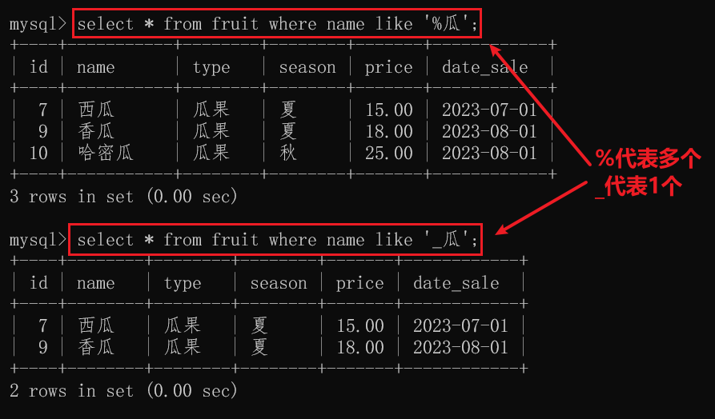
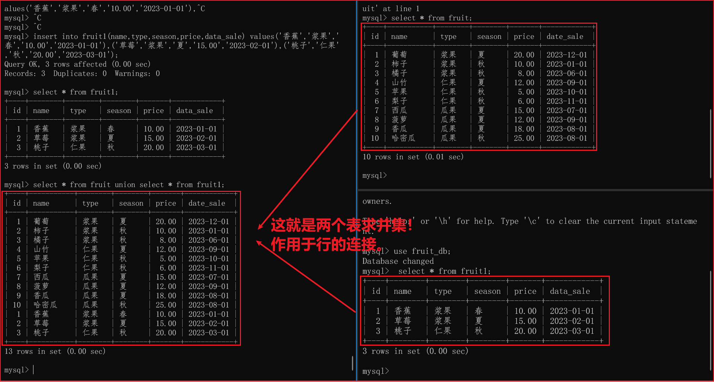
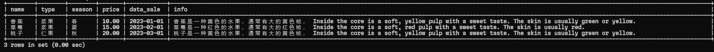
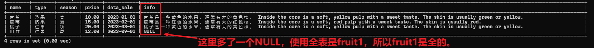
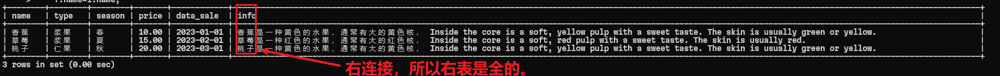
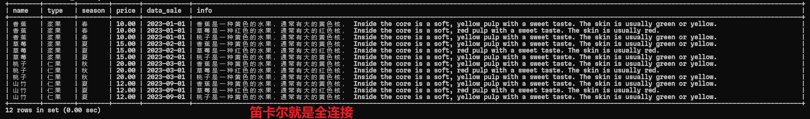
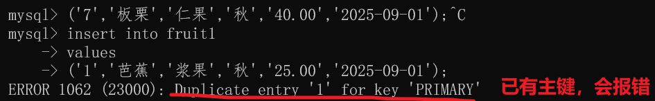
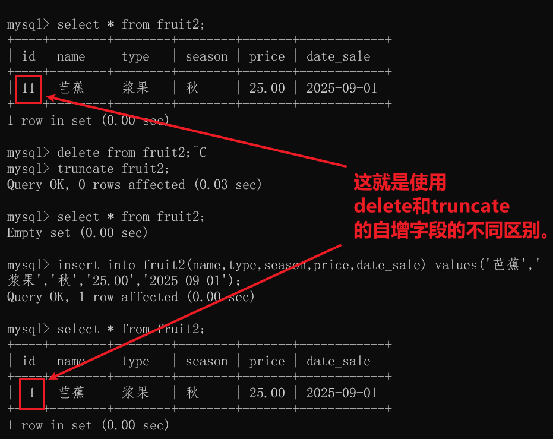
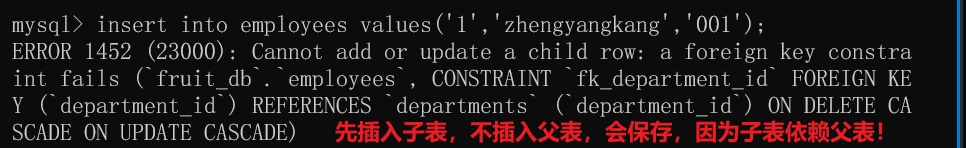
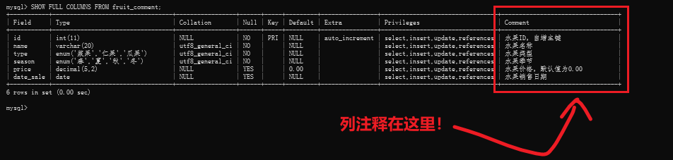

# 一、查询命令
### 0、创建数据库
```sql
create database if not exists fruit_db;
```
### 1、使用数据库
```sql
use fruit_db;
```
### 2、创建一个表单：
```sql
-- 1. 创建表（补充 IF NOT EXISTS 避免重复创建报错）
CREATE TABLE IF NOT EXISTS fruit(
    id INT PRIMARY KEY AUTO_INCREMENT,
    name VARCHAR(20),
    type ENUM('浆果','仁果','瓜果'),
    season ENUM('春','夏','秋','冬'),
    price DECIMAL(5,2),
    date_sale DATE
);
```
查看建表语句：
```sql
SHOW CREATE TABLE fruit;
```
### 3、向这个表单插入数据
```sql
-- 2. 批量插入数据（修正语法错误）
INSERT INTO fruit(
    name,
    type,
    season,
    price,
    date_sale
) VALUES
    ('葡萄','浆果','夏',20.00,'2023-12-01'),   -- 每条数据单独用()包裹，逗号分隔
    ('柿子','浆果','秋',10.00,'2023-01-01'),
    ('橘子','浆果','秋',8.00,'2023-06-01'),
    ('山竹','仁果','夏',12.00,'2023-09-01'),
    ('苹果','仁果','秋',5.00,'2023-10-01'),
    ('梨子','仁果','秋',6.00,'2023-11-01'),
    ('西瓜','瓜果','夏',15.00,'2023-07-01'),
    ('菠萝','瓜果','夏',12.00,'2023-09-01'),
    ('香瓜','瓜果','夏',18.00,'2023-08-01'),
    ('哈密瓜','瓜果','秋',25.00,'2023-08-01');  -- 最后一条末尾只有分号，无多余逗号
```

### 3、select条件查询
上面都是无脑查询，现在，我想要查询单价大于10元的所有水果信息。怎嘛办？
即，我想要`范围查询`怎么办？

```sql
# 1.查询单价大于10元的所有水果信息
select *
from fruit 
where price > 10;

# 2.查询单价在10元到15元之间的所有水果信息
select name 
from fruit 
where price between 10 and 15;
```


### 4、内置函数
> 内置函数一般都在select 子句中使用,而不能在where 等子句中使用
```sql
SUM()、MAX()、MIN()、AVG()、count()

select 
    sum(price) as 总金额,
    max(price) as 最高金额,
    min(price) as 最低金额,
    avg(price) as 平均金额,
    count(*) as 水果数量
from 
    fruit;

-- +-----------+--------------+--------------+--------------+--------------+
-- | 总金额     | 最高金额     | 最低金额     | 平均金额     | 水果数量     |
-- +-----------+--------------+--------------+--------------+--------------+
-- |    131.00 |        25.00 |         5.00 |    13.100000 |           10 |
-- +-----------+--------------+--------------+--------------+--------------+
-- 1 row in set (0.01 sec)

```
特点
 只能用于`select、order by、having`这3个子句，不能用于`where、group by`等其他子句
  王哥不行hh


### 5、分组查询
注意，这里用group by进行分组。`含义是，某一列的相同值会被分为一组。`然后对这些组进行操作。

> 展现的就是`按照分组`的结果了。

#### 5.1查询分组下的具体的水果名
```sql
select type '类型' , GROUP_CONCAT(name) '该分组下的具体水果名' 
from fruit 
group by type;
```
-- +---------+---------------------------------+
-- | 类型    | 该分组下的具体水果名            |
-- +---------+---------------------------------+
-- | 浆果    | 葡萄,柿子,橘子                 |
-- | 仁果    | 山竹,苹果,梨子                 |
-- | 瓜果    | 西瓜,菠萝,香瓜,哈密瓜         |
-- +---------+---------------------------------+
-- 3 rows in set (0.00 sec)

> 可以使用group_concat()函数查看分组中的`其他字段的所有信息`,这里的`GROUP_CONCAT(name)`表示查看该分组下的所有水果名。

#### 5.2查询分组下有多少种水果？
```sql
select type '类型' , count(name) '该分组下的水果有几种？' 
from fruit 
group by type;
```

#### 5.3查询春夏秋冬各有有多少种水果？
```sql
select season '季节' , GROUP_CONCAT(name) '春夏秋冬各有哪几种水果？' 
from fruit 
group by season;
```

### 6、分组查询的条件having

where只能用于select子句的条件查询，having用于group的条件子句

```sql
# 3.查询类型分组下，种类大于3的水果有多少种？

select type '类型' , GROUP_CONCAT(name) '该分组下的具体水果名' 
from fruit 
group by type 
having count(*) > 3;

-- +--------+--------------------------------+
-- | 类型   | 该分组下的具体水果名           |
-- +--------+--------------------------------+
-- | 瓜果   | 西瓜,菠萝,香瓜,哈密瓜          |
-- +--------+--------------------------------+

```

### 7、排序子句order by
查询单价大于10元的所有水果信息，按单价升序排序
```sql
-- 升序
select * 
from fruit 
where price > 10 
order by price asc;

-- 降序
select * 
from fruit 
where price > 10 
order by price desc;
```

### 8、限制行数limit
limit
 限制行数
  语法 limit m , n
   代表只显示从查询结果的m起的n条结果
   默认是m=0

```sql
select * 
from fruit 
where price > 10 
order by price asc;
limit 3
```

## 同为条件查询，where子句和having子句的区别？

### 1.作用对象不同：
- where
  where子句在`数据分组之前起作用`，用于筛选从`原始从数据库中读取的数据行`。它基于表中的列进行条件过滤，决定哪些行能够进入后续的处理阶段，例如聚合计算等。
  作用于原始的总数据行

- having
  having子句在`数据分组之后起作用`，用于`筛选分组后的结果集`。它通常与聚合函数一起使用，根据聚合结果进行条件过滤。
  作用于分组后的子数据组

### 2.语法及使用场景不同：

- where
  where子句可以使用表中的`列名`、`常量`、`表达式`以及比较运算符、逻辑运算符等进行条件判断。
  例如：WHERE column_name > 10。`适用于对原始数据进行基本的筛选`，比如筛选出特定日期范围内的记录、符合特定条件的客户信息等。

- having
  having子句`通常结合聚合函数使用`，例如：HAVING AVG(column_name) > 50。`适用于在对数据进行分组并计算聚合值后`，根据`聚合结果进行进一步筛选的场景`，比如找出平均销售额大于一定值的产品类别等

### 3.性能影响不同：

 - 一般来说，在可以使用where子句进行筛选的情况下`优先使用where子句`，因为它在`数据分组之前进行筛选`，可以减少参与分组和聚合计算的数据量，从而提高查询性能。


 # 二、高级查询
 ## (一)模糊查询
-  关键字： like
 
- 通配符：
   `%`代表任意个单词
   `_`代表一个单词



```sql
select * from fruit where name like '%瓜';
select * from fruit where name like '_瓜';
```

## (二) 随机查询
rand()
  需要结合`order by`子句使用，实现`查询顺序的随机化`
   举例
```sql
-- 总体随机和价格随机是一样的，都是随机。所以直接在order by后面加上RAND()
SELECT * FROM fruit ORDER BY RAND();
```

## (三)范围查询
在上面。
无非是在where子句中使用比较运算符（如大于、小于、等于等）来指定范围。

```sql
+、-、*、/、div、%、-(取负)、is null、is not null、in、not in、between A and B、not between A and B
```

## (四)子查询
### 1.定义
子查询是指在一条`select语句`中使用`另一条select语句`。`父查询是依赖于子查询的。`
> 也即，`select套娃查询。`
> 子查询几乎可以在任何子句中使用

### 2.分类
#### 2.1单值子查询
- 定义
  子查询结果返回`一行一列的结果`。也称为 `"标量子查询"`

> 说白了，就是子查询只返回一个结果的查询。

- 拓展
  标量就是`单一`的意思。

```sql
-- 查询价格高于橘子的水果信息
select * 
from fruit 
where price > all(
    select price 
    from fruit 
    where name='橘子'
);
```

#### 2.2多值子查询
- 定义
  
子查询结果返回`一列多行`的结果。多值子查询**一般放在where子句**中，并结合in、all、any、some这四个关键字来使用

> 说白了，就是子查询只返回一个结果的查询。

- 定位
>`多值子查询`一般放在`where子句`中，并结合`in、all、any、some`这`四个关键字`来使用。

|关键字|作用|
|--|--|
|in|**判断**某条记录**是否存在于**子查询返回的结果集中|
|all|代表**所有记录**，表达式需要与子查询返回的结果集中的每条记录进行比较。只有当每条记都满足比较关系时才会返回 true(真)，只要有一条记录不满足比较关系就会返回 false(假)。|
|any/some|表示**任意一条记录**，只要表达式与子查询返回的结果集中的任意一条记录满足比较关系，就会返回 true; 也可以用some替换|

> 这里主要是为了验证是否存在！
- in
```sql
-- 查询和浆果类水果同季中的所有水果信息
select * 
from fruit 
where season in(
    select season 
    from fruit 
    where type='浆果'
);
```


- all
```sql
-- 查询价格高于所有浆果类水果的水果信息
select * 
from fruit 
where price > all(
    select price 
    from fruit 
    where type='浆果'
);
```

- any/some
```sql
-- 查询价格高于任意一个浆果类水果的水果信息（求的是浆果类水果的最低值）
select * 
from fruit 
where price > any(
    select price 
    from fruit 
    where type='浆果'
);
```


#### 2.3关联子查询

- 问题引出：
  如果想要查找 price 大于平均售价的所有记录，那么使用单值子查询就可以轻松实现。现在根据类型(type)进行分组，我们思考这样一个问题：`如何找出每一组中price大于该组平均售价的所有水果呢?`

>这也引出了我们`关联子查询`的定义：

- 定义： 查询操作`需要在分组内部进行的，就要用到关联子查询`
> 简单记忆：当需要"找出每个组中符合某种条件的记录"时，就用关联子查询！

---

- **关联子查询的核心**：子查询中引用了外部查询的列`（f2.type = f1.type）`

- **执行特点**：对外部查询的`每一行都执行一次子查询`

- **适用场景**：需要进行组内比较的情况

- **性能注意**：大数据量时考虑使用JOIN优化


```sql
-- 查询每种类型中价格高于该类型平均售价的水果信息
select * 
from fruit f1 
where price > (
    select avg(price) 
    from fruit f2 
    where f1.type=f2.type
);
```
其中

- 主查询(外查询)为：

`select * from fruit f1`  

f1代表"正在检查的每一行"

- 内部查询（子查询）为：

`select avg(price) from fruit f2 where f1.type=f2.type`  

f2代表"正在计算平均值的行"。

## (五)多表查询
> 也称为多表连接。
### 1.背景引出
- 实际项目
 在实际开发中，我们并不会把`所有数据都放在一个表中`，而往往会将数据拆分到多个表中。
 
 [分表分库]如果把所有数据都放在一个表中，那么不仅维护起来比较麻烦，而且查询时速度也非常慢。将数据拆分到多个表中，不仅可以`减少冗余`，也可以确保数据的一致性和完整性。

- 实例
 fruit表中有一段很长的`info列`，保存的是水果简介。`一般文本很长，而且有不会长久用到`。这时候就会很影响整体查询性能。`将info单独放在一个表里面是很好的。这就是多表查询的实际背景。`

### 2.多表查询的分类
#### 2.1 以行为连接的操作
> 导致列增加，组合后，表的结构不变。

集合运算union
 分类
##### 1.并集[也叫联合查询]
   语法
   ```sql
    select 列名 from 表A union select 列名 from 表B;
  ```

===
```sql
-- 插入数据
INSERT INTO fruit1(
    name,
    type,
    season,
    price,
    date_sale
)
VALUES
(
    '香蕉','浆果','春',10.00,'2023-01-01'
),
(
    '草莓','浆果','夏',15.00,'2023-02-01'
),
(
    '桃子','仁果','秋',20.00,'2023-03-01'
);
```
并集命令：
```sql
select * from fruit union select * from fruit1;
```
结果如下：




##### 2.交集
  需要自己使用子查询完成，mysql只内置了并集union
  语法
  ```sql
   select 列名 from 表A where 列名 in (select 列名 from 表B);
  ```

===

```sql
 SELECT * FROM fruit WHERE name IN (SELECT name FROM fruit1);
```


##### 3.差集
    需要自己使用子查询完成，mysql只内置了并集union
    语法
```sql
select 列名 from 表A where 列名 not in (select 列名 from 表B);
```


- 使用条件

 1. 对于参与求`并集`的表来说，它们的`结构必须完全相同`，包括`列数相同、类型相同`等。

 2. union 语句必须由`两个或两个以上`的 `select` 语句组成，然后 select语句之间使用 `union 关键字`来连接。

 3. 在 union语句中，只能使用一个 `order by`子句或 `limit` 子句，并且它们`必须放在最后一个select语句之后`。

- 说明

 1. 默认会去重，如果想保留，在select后加all

实战：
我们再创建一个和fruit同结构的表单：
```sql
CREATE TABLE IF NOT EXISTS fruit1(
    id INT PRIMARY KEY AUTO_INCREMENT,
    name VARCHAR(20),
    type ENUM('浆果','仁果','瓜果'),
    season ENUM('春','夏','秋','冬'),
    price DECIMAL(5,2),
    date_sale DATE
);
```

====


#### 2.2 以列为连接的操作
> 导致行增加，组合后，表的结构会变化。

连接查询join
##### 1.分类

|连接形式|定义||
|-|-|-|
|内连接 inner join|内连接指的是多个表通过**共享列**来进行连接。在实际开发中，内连接是多表连接中**最常用的**一种方式。||
|外连接 outer join|即在**以列为依据**的连接上，**AB两个表的行的内容包含不相同**。||
|笛卡尔连接|它指的是同时从多个表中查询数据，然后组合返回的数据.||

##### 2.内外连接最大区别
> 内连接、外连接最大的区别就是，内连接只返回AB两个表中**都存在的行**，而外连接则会返回其中一个表中**所有的行**，并将另一个表中**不存在的行**用NULL填充。

===

举例：
我们将水果的详细信息存在fruit1_info表里面：
```sql
create table if not exists fruit1_info(
    id int primary key auto_increment,
    name varchar(20),
    info text
);
```

插入数据：
```sql
insert into fruit1_info(
    name,
    info
)
values
(
    '香蕉','香蕉是一种黄色的水果，通常有大的黄色核， Inside the core is a soft, yellow pulp with a sweet taste. The skin is usually green or yellow. '
),
(
    '草莓','草莓是一种红色的水果，通常有大的红色核， Inside the core is a soft, red pulp with a sweet taste. The skin is usually red. '
),
(
    '桃子','桃子是一种黄色的水果，通常有大的黄色核， Inside the core is a soft, yellow pulp with a sweet taste. The skin is usually green or yellow. '
);
```

#### 1、内连接查询：
 
现在，我们进行基于列的连接，将对应水果和其讲解匹配起来。
```sql
select
    f.name,
    f.type,
    f.season,
    f.price,
    f.data_sale,
    i.info
from
    fruit1 f
inner join
    fruit1_info i
on
    f.name=i.name;
```
---



#### 2、外连接查询：
外连接分为左外连接和右外连接。
- 左外连接left join
```sql
select
    f.name,
    f.type,
    f.season,
    f.price,
    f.data_sale,
    i.info
from
    fruit1 f
left join
    fruit1_info i
on
    f.name=i.name;
```


- 右外连接right join
```sql
select
    f.name,
    f.type,
    f.season,
    f.price,
    f.data_sale,
    i.info
from
    fruit1 f
right join
    fruit1_info i
on
    f.name=i.name;
```


#### 3、笛卡尔连接：
笛卡尔连接是指将两个表中的每一行与另一个表中的`每一行进行组合`，形成一个新的结果集。`结果集的行数等于两个表的行数的乘积。`

> 说白了就是全组合。

```sql
select
    f.name,
    f.type,
    f.season,
    f.price,
    f.data_sale,
    i.info -- 这里显示了两个表的内容。
from
    fruit1 f
cross join
    fruit1_info i;
```



# 三、增加数据
## (一)组成
```sql 
 insert into子句
 values 子句
```
例如：
```sql
-- 插入1条
insert into fruit1 
values('5','柚子','瓜果','秋','50.00','2025-09-01');

-- 插入2条
insert into fruit1 
values
('6','橙子','浆果','秋','25.00','2025-09-01'),
('7','板栗','仁果','秋','40.00','2025-09-01');
```

## (二)特例
- 顺序不一致
  在插入数据时，insert into 子句中字段名的顺序可以和表原来的字段名的顺序不一致，但是values 子句中值的顺序一定要和 `insert into 子句`中的字段名-一对应。

  另外，如果insert into 子句中`没有指定字段名`，那么values 子句中的值就必须和表中字段的`顺序一致`。

- 插入部分字段
  有时只需要针对某几个字段插入数据，而其他字段都采用默认值。

- replace 语句[针对主键]
  `插入同一主键数据`，数据已经存在，`insert是会报错的`，使用`replace即可`
  使用replace来替换即可

- 针对已有主键的插入。


```sql
-- 如果使用insert会错误。❌️
insert into fruit2
values
('1','芭蕉','浆果','秋','25.00','2025-09-01');

-- 比如使用replace，将可以覆盖主键。✅️
replace into fruit1
values
('1','芭蕉','浆果','秋','25.00','2025-09-01');
```

# 四、修改数据
## (一)组成
- update 更新数据
 
 组成update set 为某一列设置一个新值
- 说明 一般配合where使用不配合使用就是无差别修改，全改

- 举例
```sql
   update
   set
   为某一列设置一个新值
   where
   筛选出要更新的行
```
实例：
```sql
update fruit1
set
price='50.00'
where
name='柚子';
```

# 五、删除数据
## (一)逐行删除delete
### 1.组成
- delete 删除数据
 
- 说明 一般配合where使用不配合使用就是无差别删除，全删

- 举例
```sql
   delete from table
   where 筛选出要删除的行
```
实例：
```sql
delete from fruit1
where
name='柚子';
```

---
### 2.总结
- 语法：delete from 表名;
- 归属 DML：可以实现部分删除
- 性能较差，delete是逐行删除，`每删除一次就在日志文件里面记录一次，性能较差。`
- 自增字段，自增字段的值是上一次加1

## (二)整表删除truncate
### 1.组成
- truncate 删除数据
  组成truncate 表名
- 说明 不能配合where使用，是`无差别删除，全删`

- 举例
```sql
   truncate 表名
```
实例：
```sql
truncate fruit1;
```

---
### 2.总结
- 语法：truncate 表名;
- 归属 DML：可以实现整表删除
- 性能较好，truncate是整表删除，`不会在日志文件里面记录每次删除操作，性能较好。`
- 自增字段，自增字段的值会被重置为初始值

### 补充：何为自增字段？
上述delete和truncate都提到了自增字段，那么`自增字段是什么含义呢？`

>1. 自增字段的基础定义

自增字段（Auto-Increment Column）是数据库中一种特殊的字段类型（如 MySQL 的 AUTO_INCREMENT，核心作用是：当向表中插入新记录时，该字段会自动生成一个唯一的、递增的数值（**默认从 1 开始，每次 + 1**），无需手动赋值，常用于作为表的**主键（保证主键唯一）。**

>2. 结合 DELETE 操作的关键行为

当执行 DELETE FROM 表名;（清空全表）后，**自增字段的 “递增基准”不会重置**，而是保留 “上一次最后生成的值”—— 新插入数据时，自增字段的值 = 上一次最后生成的值 + 1，而非重新从 1 开始。

但是，**如果执行了 TRUNCATE TABLE 表名;（清空全表），则自增字段的 “递增基准”会被重置为默认值 1**。



# 六、操作库
- 创建数据库
 create databases 数据库名;
- 查看数据库
 show datebases;
- 修改数据库
 alter databases 数据库名 default character set = gb2312
- 删除数据库
 drop database 数据库名;

# 七、操作表-创建、删除、修改、查看、复制

### 1.创建表
 ```sql
 create table 表名(
  字段名 数据类型,
  字段名 数据类型,
  ...
 );
 ```
### 2.删除表
注意，这是在表的层面删除，而前面的delete和truncate是在数据的层面(即数据行)上进行删除。
 ```sql
 drop table
 ```

### 3.修改表
```sql
 alter table
---具体的句式如下：
  修改表名
   alter table 旧表名 rename to 新表名;
   ---
  修改字段
   添加字段
    alter table 表名 add 字段名 数据类型;
   删除字段
    alter table 表名 drop 字段名;
   修改字段名
    alter table 表名 change 原字段名 新字段名 新数据类型;
   修改数据类型
    alter table 表名 modify 字段名 新数据类型;
```
### 4.查看表
```sql
 show tables;
 show create table 表名;
 describe 表名;
```

### 5.复制表
#### 5.1复制结构
  `create table 新表名 like 旧表名;`
  会复制旧表的完整结构，包括主键、自动递增、索引等。但只能复制结构，不能复制数据。

#### 5.2复制结构和数据
  `create table 新表名 as (select *from表名);`
  不会复制旧表的主键、自动递增、索引等,但可以复制数据。


# 八、列的属性

## (一)约束型属性
### 1.primary key 主键
- 特点，唯一性，`不允许为null`
- 作用，作为表中数据的唯一标识，就像一个人一样，只有`ID身份证`才能唯一标识他。`性别、年龄标识不了。`
- 说明：

- 联合主键，多个列一起作为同一个主键[注意不是多个主键]

#### 问题： 
- 1.每一个表都必须要有一个主键吗?

并不是每一个表都要有一个主键，只不过一般情况下最好有主键。因为使用主键可以保证数据的完整性，并且还可以提高查询效率。

- 2.[建立了索引]外键名和主键名必须要相同吗?

外键名和主键名并`不一定要相同`，只不过在实际开发中，当外键与对应的主键处于不同的表中时，`为了便于识别，我们一般设置相同的外键名和主键名。`另外，外键和主键也可以处于同一个表中。

### 2.unique 唯一约束
某一列中`存在的值都是唯一的`，不允许出现重复的值。但`可以允许有多个null值。`

#### 唯一键和主键的区别
- 唯一键：某一列中`存在的值都是唯一的`，不允许出现重复的值。但`可以允许有多个null值。`
- 主键：某一列中`存在的值都是唯一的`，不允许出现重复的值。但`不可以允许有多个null值。`
- 一个表只能有一个主键，但可以有多个唯一键。
 
> 何为外键？

================================================

### 3.foreign key 外键
#### 语法
```sql
 constraint 外键名 
 foreign key(子表的列名) references 父表名(父表的列名)
```
实例：

#### 定义
 在 MySQL 中，可以使用 `foreign key 属性`来设置一个外键。外键指的是`子表中的某一列(或字段组合)受限于(或依赖于)父表中的某一列`
> 比如说，员工表、部门表，员工表中肯定有部门的字段，这个字段就依赖于部门表的外键。一般是主键。

> 那既然如此，显然一个表可以有多个外键！

#### 说明
 
 外键使用

  一般把`父表的主键作为子表的外键。`
  插入数据时，必须`先插入父表`，然后`才能插入子表`
  删除表时，必须`先删除子表，然后才能删除父表`

#### 源码体现：
##### 1.部门表：
```sql
-- 创建主表（父表）
CREATE TABLE departments (
    department_id INT PRIMARY KEY,
    department_name VARCHAR(100) NOT NULL
);
```

##### 2.员工表
```sql
-- 创建从表（子表）并定义外键
CREATE TABLE employees (
    employee_id INT PRIMARY KEY,
    employee_name VARCHAR(100) NOT NULL,
    department_id INT,
    -- 命名外键约束名字
    CONSTRAINT fk_department_id

    -- 定义外键约束
    FOREIGN KEY (department_id) 
        REFERENCES departments(department_id)
        ON DELETE CASCADE -- 当部门被删除时，该部门的所有员工也会被删除
        ON UPDATE CASCADE
);
```

外键约束动作:
```sql
-- 1. CASCADE：级联删除
FOREIGN KEY (department_id) 
    REFERENCES departments(department_id)
    ON DELETE CASCADE
-- 当部门被删除时，该部门的所有员工也会被删除

-- 2. SET NULL：设置为NULL
FOREIGN KEY (department_id) 
    REFERENCES departments(department_id)
    ON DELETE SET NULL
-- 当部门被删除时，员工的department_id设为NULL

-- 3. NO ACTION / RESTRICT：禁止删除（默认）
FOREIGN KEY (department_id) 
    REFERENCES departments(department_id)
    ON DELETE NO ACTION
-- 如果有员工属于该部门，则不允许删除该部门
```

插入数据有顺序,先父后子，否则报错，因为子依赖父。




如果，约束条件式`NO ACTION`，则删除数据有顺序,先子后父，否则报错，因为子依赖父。

## (二)其他属性
### 1.default 默认值
 语法
  列名 类型 not null
 说明
  为某些列设置默认值，比如地址[实际上起始默认值都为null]
### 2.not null 不允许为空
 语法
  列名 类型 not null
 说明
  有些列不允许为null，就用这个来指明
### 3.auto_increament 自动递增
 语法
  列名 类型 auto_increment
 说明
  1. auto_increment只能用于`整数列`，而不能用于其他类型的列。
  
  2. 一个表中`最多只能有一个`具有 `auto_increment 属性`的列。
  
  3. 只能给`已经建立了索引的列设置 auto_increment属性`。主键列和唯一键列会`自动建立索引`。[所以一般只能给主键、唯一键使用自增属性]。
  
  4. 如果某一列设置了 auto_increment属性，那么该列`不能`再使用 `default 属性`来指定默认值。
  
  5. 如果某一列设置了 auto_increment属性，那么 MySQL会自动帮该列生成一个唯一值。该值从1开始，然后每次递增 1。
  
  6. 如果某一列设置了 auto_increment属性，那么该列的值就是自动递增的，所以在插入数据时`可以不指定该列的值。`
  
  7. MySQL 使用 auto_increment 属性来实现自动递增，而 SQL Server 使用 identity 属性来实现自动递增。

### 4.comment 备注
 说明
  注释内容是字符串，需要使用英文单引号引起来。

举例：
```sql
CREATE TABLE IF NOT EXISTS fruit_comment(
    id INT PRIMARY KEY AUTO_INCREMENT COMMENT '水果ID，自增主键',
    name VARCHAR(20) NOT NULL COMMENT '水果名称',
    type ENUM('浆果','仁果','瓜果') NOT NULL COMMENT '水果类型',
    season ENUM('春','夏','秋','冬') NOT NULL COMMENT '水果季节',
    price DECIMAL(5,2) DEFAULT 0.00 COMMENT '水果价格，默认值为0.00',
    date_sale DATE COMMENT '水果销售日期'
) COMMENT='水果信息表，包含各种水果的详细信息';
```
插入一条数据看看：
```sql
INSERT INTO fruit_comment(name,type,season,price,date_sale)
VALUES('苹果','浆果','春',10.00,'2023-01-01');
```
#### 如何查看注释呢？
```sql
SHOW FULL COLUMNS FROM fruit_comment;

```



=====

# 九、视图 > 表的指针
## (一)引出
我们来看一个语句：
```sql
select 
    fruit1.id,
    fruit1.name,
    fruit1.type,
    fruit1.season,
    fruit1.price,
    fruit1.data_sale,
    fruit1_info.info
from
    fruit1
inner join
    fruit1_info
on  fruit1.name=fruit1_info.name;
```
简化很长的select语句。假设下面的语句经常执行，每次都写挺麻烦的，所以提出了将这条select语句`保存`的解决方案，
即`将这条select保存起来`，保存了`这条select语句的虚拟表(临时表)`，`就称为“视图”`。这样`再次查询相关内存就会得到简化。`

## (二)视图、视图名定义

- 视图是保存某条select语句的`临时表(虚拟表)`。

- 视图名就是`某条select语句的别名`  。即，视图不存储数据，只存储查询逻辑。正因如此，视图的操作和原表互通的。就像指针。

- 在创建视图时，`是将某条select语句保存起来`，而`非将select语句的查询结果保存起来。`

- 一旦创建，视图会一直存在于数据库中，直到：

>你显式删除它

>它依赖的基础表被删除

>数据库被删除

### 语法
```sql
CREATE VIEW fruit1_all AS
SELECT 
    f.id,
    f.name,
    f.type,
    f.season,
    f.price,
    f.data_sale,
    fi.info
FROM fruit1 f --可以这样简化查询哦~~f就代表fruit表了！
INNER JOIN fruit1_info fi ON f.name = fi.name; --可以这样简化查询哦~fi就代表fruit_info了！
```

### 查看视图
```sql
-- 视图和表一样，都可以使用普通数据表的用法
-- 查询视图所有信息
select * from fruit1_all;

-- 查询所有表(视图也在里面)
show tables;
```


## (三)视图作用

- 聚焦特定数据
>比如某一个表的列非常多，而我们一般只会用到`某几个列的数据`，此时就可以`使用视图来聚焦特定的数据`，为`用户定制数据`。

- 提高重用性
>如果`一个查询操作经常被使用`，并且select语句本身又长又复杂(比如使用了很多聚合函数、关联了其他表等 )，那么我们`可以将其保存成一个视图。`

- 提高安全性
>对于一些`不能被修改的重要字段，如果我们不希望其被用户误操作`，那么可以使用视图只显示一些不重要的字段，`而把那些重要的字段隐藏起来。`


## (四)视图与表的区别
表保存的是`实际的数据`，视图保存的是`一条select语句（视图本身不存储数据）`。
所以简单来说，视图是一个`临时表、虚拟表`。在使用视图进行所有操作时，都是将`视图转化为原来的select语句来操作。`


> 注意，`视图和原表共享同一份数据`，`两者之间的更改会相互影响。`

> 子查询、多表查询(union、inner join)的视图中，不能执行`insert\update`,这两种操作。而使用`普通select语句`的视图是允许执行`insert`和`update`的

## (五)视图说明
### 1.数据修改性

在mysql中，`并不是所有的视图都是可以修改数据的`，比如以下就不行:

- 包含聚合函数的视图。

- 包含子查询的视图。

- 包含 distinct、group by、having、union 等关键字的视图。

- 由不可更新的视图所创建的视图，

### 2.不是所有的select就可以保存成视图

- select 语句不能包含 from 子句中的子查询。

- select语句不能引用系统变量或用户变量。

- select语句不能引用预处理语句参数。

### 3.其他属性：

- 嵌套性
>视图可以嵌套，也就是基于一个视图去建立另一个视图。

- 无索引性
>不能给视图建立索引，也不能有相关的触发器(因为视图本身是没有数据的)。

- 费性能
>视图的个数没有限制，但是过多的视图会影响 MySQL的性能。

- 连接性
>视图可以和表一起使用，比如连接表和视图的 select语句。


```sql
CREATE ALGORITHM=UNDEFINED DEFINER=`skip-grants user`@`skip-grants host` SQL SECURITY DEFINER VIEW `fruit1_all` AS select `f`.`id` AS `id`,`f`.`name` AS `name`,`f`.`type` AS `type`,`f`.`season` AS `season`,`f`.`price` AS `price`,`f`.`data_sale` AS `data_sale`,`fi`.`info` AS `info` from (`fruit1` `f` join `fruit1_info` `fi` on((`f`.`name` = `fi`.`name`)))
```