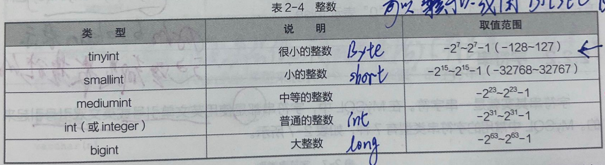

# 二、SQL语法
## 1. SQL定义
SQL（StructuredQueryLanguage）即`结构化查询语言`，它是`数据库的标准语言`。SQL非常简洁，它只有`6个常用动词`：
- `insert（增）`
- `delete（删）`
- `select（查）`
- `update（改）`
- `create（创建）`
- `grant（授权）`

## 2. SQL分类
sql可以分为3大类：
### 2.1数据定义语言（DDL）：
`create（创建）`、`alter（修改）`、`drop（删除）`
常见语句是：
```sql
create table table_name(
    column1 datatype,
    column2 datatype,
    column3 datatype,
    ...
);

alter table table_name
add column column_name datatype;

drop table table_name
```

### 2.2数据操纵语言（DML）：
`insert（增）`、`delete（删）`、`select（查）`、`update（改）`
常见语句是：
```sql
insert into table_name(
    column1,
    column2,
    column3,
    ...
)values(
    value1,
    value2,
    value3,
    ...
);

delete from table_name
where condition;

select column1,column2,...
from table_name
where condition;

update table_name
set column1 = value1,
    column2 = value2,
    ...
where condition;
```

### 2.3数据控制语言（DCL）：
`grant（授权）`、`revoke（取消授权）`
```sql
grant permission on object to user;

revoke permission on object from user;
```

## 3.关键字
关键字是指sql自己在使用的单词，因此再给数据库命名时，不能再使用关键字。
常用关键字如下：
```sql
select、from、where、group by、order by、distinct、like、insert、delete、update、create table、alter、drop、is not、inner join、left outer join、right outer join、procedure、function
```

## 4.语法规则
SQL本身是一门编程语言，所有有自己的语法规则。不过它很简单，我们只需要记住以下几点：
- 所有的sql语句都以分号结尾。
- 所有的sql语句都不区分大小写。[一般来说，关键字大写，其他的小写]

## 5.命令规则
- 不能是SQL关键字。
- 不能以数字开头，并且只能使用`英文字母`、`数字`、`下划线`。

## 6.语法规则
### 6.1数值
#### 6.1.1组成形式
```
{0,1,2,3,4,5,6,7,8,9,+,-,.}
```

#### 6.1.2分类标准
- 整数
- 浮点数
- 定点数




- 字符串
- 日期时间
- 二进制


