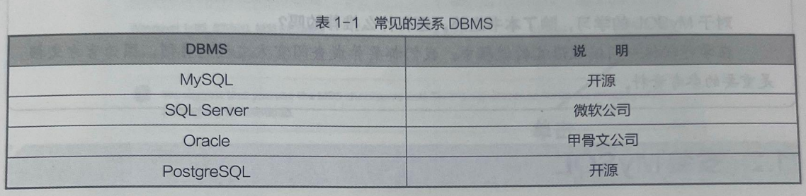
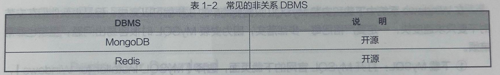

# 一、基础概念
### 1.DBMS
Database Management System，即`数据库管理系统`，DBMS 是数据库的 “引擎” 本身，是运行在`服务器端的底层软件`。如MySQL、Oracle、SQL Server等。

那么接下来，我们DBMS和数据库等价。

### 2.数据库
顾名思义，数据库就是一个`存储数据`的`仓库`。

### 3.数据库分类
关系型数据库：

非关系型数据库：

### 4.SQL
全称：`Structured Query Language`，即`结构化查询语言`。
是用来`操作数据`的`专用语言。`

### 5.SQL与数据库的关系
SQL是数据操作语言，而数据库(MySQL、SQL Server等)是基于这门语言的软件。

